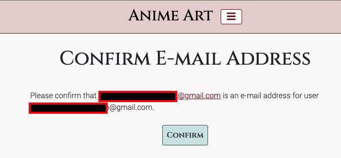
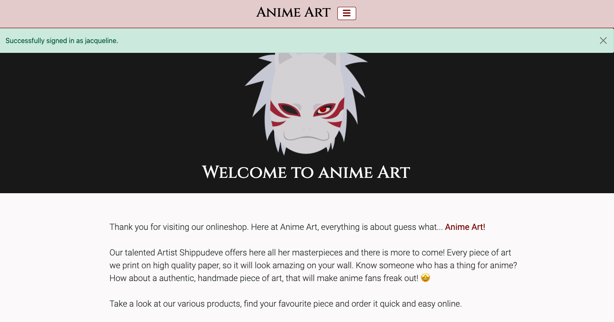

# MS4-anime-art


# Table of contents
- [UX](#ux)
    - [Business goals](#business-goals)
    - [Customer goals](#customer-goals)
    - [Structure of the website](#structure-of-the-website)
    - [Wireframes](#wireframes)
    - [Surface](#surface)
- [Features](#features)
    - [Existing features](#existing-features)
    - [Features left to implement](#features-left-to-implement)
- [Database Schema](#database-schema)
- [Technologies used](#technologies-used)
- [Database](#database)
- [Deployment](#deployment)
- [Credits](#credits)


#  UX 
### Backstory:
My friend [Shippudeve](https://www.instagram.com/shippudeve/) draws amazing anime images - both <b>classic (with pen and paper) and also digital</b>. This e-commerce website should help her in the future to be able to sell her drawings as posters and with more features implemented, she can even draw images on request or on different materials (like shoes or shirts). To support her talent the idea of "Anime Art" came up. 

<b>Anime Art stands for exclusive, selfmade drawings that you can purchase nowhere else.</b> One day every anime fan (or not fan) should be able to say: "I have a drawing of [Shippudeve](https://www.instagram.com/shippudeve/), the great artist". 


## Business goals
### As a business owner:
- I want to generate revenue through offering a product that can be purchased through a webshop.
- I want the user to understand what product I am offering.
- I want to offer only exclusive products, that a user cannot purchase anywhere else.

## Customer goals
### As a user
- I want to be able to view products so that I can purchase the products I like.
- I want to be able to view the product details so that I can see the product name, product prize, product description and product image.
- I want to be able to understand what the webshop is selling so that I can evaluate if I am interested in the products.
- I want to be able to register for an user account so that I can view my profile.
- I want to be able to login and logout so that I can access my profile.
- I want to be able to reset my password so that I can access my profile in case I lost the password or secure my account by changing the password.
- I want to be able to receive an email confirmation after registering so that I can know I registered successfully.
- I want to be able to view my profile so that I can see my order history, open requests and save my information for future orders.
- I want to be able to filter products so that I can find easily the products by category.
- I want to be able to search for a product by name or description so that I can find a specific product.
- I want to be able to see what I have searched for and the number of results so that I can know if there are results.
- I want to be able to select the quantity of a product so that I can purchase a certain amount.
- I want to be able to view products in my cart so that I can always be aware of what I am about to purchase and how much it will cost.
- I want to be able to adjust the quantity of products in the cart so that I can delete or add more of the product.
- I want to be able to delete products in my cart so that I can change my mind at any given time.
- I want to be able to enter my payment information so that I can checkout quick and easy.
- I want to be able to get an order confirmation after checkout so that I can double check that my data is correct.
- I want to be able to receive an email confirmation so that I can keep track on my purchases and won't loose it.


## Structure of the website
Anime Art is a responsive e-commerce website, so it is optimized for <b>all devices and screen sizes (desktop, mobile and tablet)</b>.

It has an intuitive, user friendly interface with an easy to use <b>navigation bar</b> on top. From the <b>homepage</b> a user can choose directly which kind of products to check out and on the <b>about</b> page the user finds exlpanation about Anime Art and its products.On the products navigation menu item, a user has another way to find either all products or the products filtered by type.

On the <b>account</b> menu item a user can <b>register or login</b>. When a user registers, a form has to be filled out and the user receives an email, which has to be confirmed before the account is created successfully. When a user is already logged in, the user has the possibility to view their <b>profile</b> or to <b>logout</b> of their account.

When clicking on the shopping cart icon, the user is able to <b>view their shopping cart</b>, so what they are about to purchase. From the shopping cart, the user can purchase what is in the shopping cart by clicking on a button ("go to secure checkout") and filling out a form on the <b>checkout page</b>. The form contains input fields for shipping/billing information and card as a payment method. On this page the user can also review what they are about to purchase (in the order summary).

When actually purchasing the product and the purchase was successful, the user will land on a "thank you" page with a summary of all information (user information and information of the product that was purchased).

## Wireframes
Wireframes can be found here: [WIREFRAMES](readme-files/wireframes/anime-art-wireframes.pdf)

## Surface
### Fonts
- Headlines (h1-h6) and buttons: [Cinzel](https://fonts.google.com/specimen/Cinzel)
- All other elements (like paragraphs, links, etc.): [Roboto](https://fonts.google.com/specimen/Roboto)

### Colors
- Primary background-color: #fbf9f9

- Secondary background-color: #e0cccc

- Main font color: #000000

- Borders, texts, icons: #650000

Buttons:

- Red: border and text #650000 | background #e0cccc

- Green: border and text #3d4343 | background #cce0e0

### Effects
- All buttons have a hover grow effect

### Images
- Product images created by [Shippudeve](https://www.instagram.com/shippudeve/)
- Heroimage from [Pixabay.com](https://pixabay.com/de/illustrations/naruto-ninja-maske-charakter-5752319/)
- Loading Spinner from [Pixabay.com](https://pixabay.com/de/illustrations/moe-frau-m%c3%a4dchen-manga-anime-595954/)
- Image "Image coming soon" from [Freeiconspng.com](https://www.freeiconspng.com/downloadimg/23499)
- Favicon from [Softicons.com](https://www.softicons.com/culture-icons/sharingan-icons-1.5-by-harenome-razanajato/kakashi-icon)


# Apps & Features

## Global features
### Navigation
- The Logo "Anime Art", brings the user always to the homepage
- The website has a Bootstrap5 <b>Offcanvas</b> side navigation. It is functional and adjusted for every screensize.


The different navigation items:
- The shopping cart: The total price is shown next to the shopping cart icon, when a user adds something to the cart

- Products: The user can open a dropdown item to see and select the different types of products
- The options are "All Products", "Digital Drawings" or "Classic Drawings"

- Account: Via the account dropdown menu, a user can register or login (when logged out) <b>or</b> view the profile or logout (when logged in)


- Admin: When a user has admin rights (is a superuser), the user can add products. The option for this is shown by clicking on the dropdown item "Admin". As in the future there should be more items related to admin, this is a dropdown as well.

- About us: This item is not a dropdown. By clicking on this item, the user will land on the "about us" page
- When a user opens a dropdown item and then clicks on another one, the previous dropdown closes by itself
- In the navigation is also included the search field

#### Search
- The search field is included in the navigation offcanvas

- When clicking on the search button without typing search input, the field will throw an error

- The search field queries in all product names and product description to find a match
- It brings the user to the product list page, where will be all products shown that match the search criteria
- When there is no match, the user lands on the product list page with and sees an error message


### Authentication (django-allauth feature)
- Django-allauth is a Python package
- "Integrated set of Django applications addressing authentication, registration, account management as well as 3rd party (social) account authentication." ([django allauth documenation](https://django-allauth.readthedocs.io/en/latest/))
- It provides a set of features such as signup, login, logout and password change
- After signing up, a verification e-mail is sent to the registered e-mail to confirm it
- Once confirmed, the user can log in with their credentials and access the profiles app
- The links to these features can be found in the navigation, under the "Account" dropdown menu
- Screenshots of the flow:





### Messages (django, styled with bootstrap)
- There are many ways what message a user might receive throughout the website
- The messages are Bootstrap5 alerts
- Here are some examples:





### Back to top button
- On every page there is a <b>back to top button</b>, that the user can click to have an easy way to go to the top of the page without scrolling


### Automatic emails

### Home app
- `home` django app includes two pages `home page` and `about page`

#### Home
- On the `home page` the user will be welcomed and can read a short introduction to the Anime Art Onlineshop. The user can also start looking for products by clicking on one of the three prominent CTAs


#### About
- The `about page` is informative. The user can read here about why Anime Art was founded, about the products it offers and about the artist, who creates the products. Also the user can find a small FAQ on this page


### Products app
`products`

#### Products (List Page)

#### Product Display

#### Admin
Edit & Update images: - No image upload --> explain in Readme: replace image field with text(string) field -> (have user upload image somewhere else like aws)
- static files nicht in /media/
-> document in the README that aws and image upload will be a future feature  and add screenshots of admin (how it looks like)

#### Filter

### Profiles app
`profiles`


### Cart app
`cart`

### Checkout app
`checkout`


## Features left to implement:
- Footer with imprint, SEO Texts, Contact Us page, Newsletter Signup

- django pagination (too many products on one page)
- Leave out sorting for now, might add later when time left

-> document in the README that aws and image upload will be a future feature  and add screenshots of admin (how it looks like)


# Technologies used

## Languages
- [Python](https://www.python.org/): logic and structure for backend
- [JavaScript](https://en.wikipedia.org/wiki/JavaScript): to add interactivity to the frontend
- [HTML](https://en.wikipedia.org/wiki/Hypertext_Markup_Language): to structure the website
- [Jinja](https://jinja.palletsprojects.com/en/2.11.x/): templating language for python

## Database
- [SQLite](https://www.sqlite.org/index.html): default database in django; used in development
- [PostgreSQL](https://www.postgresql.org/): production database in heroku

## Styling
- [CSS](https://en.wikipedia.org/wiki/Cascading_Style_Sheets): to style the HTML code
- [Bootstrap 5.1](https://getbootstrap.com/docs/5.1/getting-started/introduction/): to add responsiveness, styling and some functionality
- [Fontawesome](https://fontawesome.com/): as an icon library
- [Google Fonts](https://fonts.google.com/): as a font resource
- [Favicon](https://favicon.io/): to generate favicon

## Frameworks and libraries
- [Django](https://www.djangoproject.com/): high-level Python web framework
- [JQuery](https://jquery.com/): as a JavaScript library

## Planning
- [Balsamiq](https://balsamiq.com/): for creating wireframes
- [Google Sheets](https://en.wikipedia.org/wiki/Google_Sheets): to write user stories and planning the data models
- [DBeaver](https://dbeaver.io/): for database schema

## Testing
- [Am I responsive?](http://ami.responsivedesign.is/): for checking responsiveness on different screen sizes and using screenshot as a showcase for this projects README.md
- [Comparium](https://front.comparium.app/livetesting): For live testing on different browsers
- [Chrome Developer Tools](https://developers.google.com/web/tools/chrome-devtools): constantly testing styling, responsiveness and functionality

## Miscellaneous:

- [Github](https://github.com/): for hosting the projects repository
- [Git](https://en.wikipedia.org/wiki/Git): for version control
- [Heroku](https://www.heroku.com/): cloud platform for deploying web app
- [Stripe](https://stripe.com/en-gb-de): to manage (test) payment transactions
- [Visual Studio Code](https://code.visualstudio.com/): as a IDE (Integrated Development Environment) for developing the project
- [Popper.js](https://getbootstrap.com/docs/5.1/getting-started/introduction/): required for using bootstrap
- [Stripe](https://stripe.com/docs/webhooks/signatures): for payments
- [Gmail](https://www.google.com/intl/en/gmail/about/): for sending emails

## Code Validation Tools
- [PEP8 checker](http://pep8online.com/): to validate Python code
- [JShint](https://jshint.com/) to validate JavaScript code
- [W3 CSS Validator](https://jigsaw.w3.org/css-validator/) to validate CSS code
- [W3 HTML Validator](https://validator.w3.org/) to validate HTML code

# Database
## Entity Relationship Diagram


## Data Models

# Deployment
To run this project, you have to install 
- [Python3](https://www.python.org/downloads/): to run the app
- [PIP](https://pip.pypa.io/en/stable/installation/): to install all app requirements
- Any [IDE](https://en.wikipedia.org/wiki/Integrated_development_environment) (e.g. [Visual Studio Code](https://code.visualstudio.com/)) or if you want to work virtually e.g. [Gitpod](https://www.gitpod.io/)
- [GIT](https://gist.github.com/derhuerst/1b15ff4652a867391f03): for cloning and version control

And you have to create (free) accounts for these services:
- [Stripe](https://stripe.com/en-gb-de)
- [Gmail](https://www.google.com/intl/en/gmail/about/)

## [Local deployment](https://docs.github.com/en/github/creating-cloning-and-archiving-repositories/cloning-a-repository)
1. Clone repository
- Go to repository
- Click on the button "code"
- Select the "HTTPS" option
- Copy the URL presented
- Open your Terminal
- Create a directory for storing this repository
- Type `git clone https://github.com/jacqueline-kraus/MS4-anime-art.git`
- Press enter to create local clone repository
- Alternatively, if using Gitpod, you can click below to create your own workspace using this repository

[](https://gitpod.io/#https://github.com/jacqueline-kraus/MS4-anime-art)

2. Set up environment variables
- Create an `.env.py` file with your own credentials. You can use this [.env_sample.py](https://github.com/jacqueline-kraus/MS4-anime-art/blob/main/env_sample.py) file as a sample and insert your environment variables

3. Install all requirements from `requirements.txt`:
```
pip3 install -r requirements.txt
```

4. Migrate the models to create the database schema:
```
python3 manage.py makemigrations
```
```
python3 manage.py migrate
```

5. Load the data fixtures in this exact order:
```
python3 manage.py loaddata types
```
```
python3 manage.py loaddata products
```

6. Create a superuser in order to access the django admin panel:
```
python3 manage.py createsuperuser


(assign an admin username, email, and secure password)
```

7. Launch the django project in the IDE terminal:
```
python3 manage.py runserver
```

8. Log into django admin
- After running the web app, add `/admin` at the end of the URL and log in with the superuser credentials from the previous step

## Heroku Deployment
1. For Heroku to know which required dependencies to install, first create a `requirements.txt` file by running the following command in the CLI:
```
pip3 freeze --local > requirements.txt
``` 

2. Create a `Procfile` in the root directory and add the following line to the file:
```
web: gunicorn anime_art.wsgi:application
```

3. Sign up and/or log in to [Heroku](https://www.heroku.com/)

4. Create a new app by clicking on the button "New"

5. Give your app a name, select your region and click "Create app"

6. Navigate to the "Deploy" tab and select "Github" as a deployment method

7. Search for your repository name and connect

8. Set up Heroku Postgres
- In the 'Resources' tab search for 'Heroku Postgres'
- Select the 'Hobby Dev' free plan

9. Set up conf variables
- Open the "Settings" tab and click on "Reveal Config Vars"
- Add your configuration variables, you can find these in your `.env.py` file

10. Set up new database
- In `settings.py`:
```
import dj_database_url
```
- Comment out `DATABASES` (temporarily, do not commit/push this code to GitHub until instructed so)
- Add this code snippet:
```
if 'DATABASE_URL' in os.environ:
    DATABASES = {
        'default': dj_database_url.parse(os.environ.get('<your Postgres database URL>'))
    }
else:
    DATABASES = {
        'default': {
            'ENGINE': 'django.db.backends.sqlite3',
            'NAME': os.path.join(BASE_DIR, 'db.sqlite3'),
        }
    }
```

11. Migrate the models to Postgres database:
```
python3 manage.py makemigrations
```
```
python3 manage.py migrate
```

12. Load the data fixtures in this exact order:
```
python3 manage.py loaddata types
```
```
python3 manage.py loaddata products
```

13. Create a superuser in order to access the django admin panel:
```
python3 manage.py createsuperuser


(assign an admin username, email, and secure password)
```

14. Push to GitHub:
```
git add.

git commit -m "<your commit message>"

git push
```

10. Set up automatic deploys
- Go back to Heroku, navigate to the tab "Deploy" and enable "Automatic Deploys"
- Everytime you push now to your Github repository the changes will be automatically deployed in Heroku.

## Handling payments with Stripe
1. Sign up for a free Stripe account

2. Navigate to the Developers section > click on API Keys

3. You should have two confidential keys which need to be added to your `.env` file and your Heroku Config Vars:
- Publishable Key (`STRIPE_PUBLIC_KEY`): pk_test_key
- Secret Key (`STRIPE_SECRET_KEY`): sk_test_key

## Sending emails through Gmail
1. If you don't have any Gmail account yet, then you have to create one

2. Navigate to "Other Google Account Settings" > "Security" tab > turn on 2-step-verification

3. Go back to "Security" tab and click on "App passwords"

4. Select "Mail" (in app dropdown) > select "Other" (in device dropdown)

5. Copy the 16-character password

6. Open Heroku > Settings > Reveal Config Vars

7. Add copied password to `EMAIL_HOST_PASS` config var

8. Add the Gmail email address to `EMAIL_HOST_USER` config var


# Credits

## Images
- Product images created by [Shippudeve](https://www.instagram.com/shippudeve/)
- Heroimage from [Pixabay.com](https://pixabay.com/de/illustrations/naruto-ninja-maske-charakter-5752319/)
- Loading Spinner from [Pixabay.com](https://pixabay.com/de/illustrations/moe-frau-m%c3%a4dchen-manga-anime-595954/)
- Image "Image coming soon" from [Freeiconspng.com](https://www.freeiconspng.com/downloadimg/23499)
- Favicon from [Softicons.com](https://www.softicons.com/culture-icons/sharingan-icons-1.5-by-harenome-razanajato/kakashi-icon)


## Problem solving helpers
- [Django documentation](https://docs.djangoproject.com/en/3.2/)
- [Bootstrap documentation](https://getbootstrap.com/docs/5.1/getting-started/introduction/)
- [W3Schools.com](https://www.w3schools.com/)
- [MDN Web Docs](https://developer.mozilla.org/en-US/docs/Learn)
- [Stackoverflow](https://stackoverflow.com/)
- [Python documentation](https://docs.python.org/3/)

## Code
- [Boutique Ado Walkthrough Project from Code Institute](https://github.com/Code-Institute-Solutions/boutique_ado_v1): for understanding how django works, coded along many steps, to understand the concepts
- [Bootstrap](https://getbootstrap.com/docs/5.1/getting-started/introduction/)
- [Google Fonts](https://fonts.google.com/): for the fonts used
- [Fontawesome](https://fontawesome.com/): for the icons
- [Ordinarycoders](https://www.ordinarycoders.com/blog/article/django-messages-framework): using messages in Django with bootstrap
- [Django-allauth.readthedocs.io](https://django-allauth.readthedocs.io/en/latest/installation.html): django allauth for authentication
- [Hover.css](https://github.com/IanLunn/Hover/blob/master/css/hover.css): hover effects
- [Stackoverflow](https://stackoverflow.com/questions/39031224/how-to-center-cards-in-bootstrap-4): aligning the product cards in center
- [SmileyChris](https://github.com/SmileyChris/django-countries): django countries in ISO format
- [Mdbootstrap](https://mdbootstrap.com/docs/standard/extended/back-to-top/):back to top button

## Acknowledgments
- 
- 
- 


# NOTES
- feature screenshots can be reused in testing readme

#### Readme

- Database schema (as image) ERD (entity relationship data)


### Other
- Finish Readme
- write down a simple marketing strategy, why some things are like they are

#### bugs:
- profile page footer --> not sticky
- loading times


### Missing
- image of eve in about


DEBUG TRUE TO FALSE!!!

q:

- should  delete social accounts?
- should I delete all my test users ?
- Should I delete all test orders?
- Login redirect landing page (when the user is in the checkout and logins, he goes to homepage)
- should I make the alerts push down the page or is overlay ok?
- Is it correct that I deleted "DISABLE_COLLECTSTATIC" in heroku config vars?