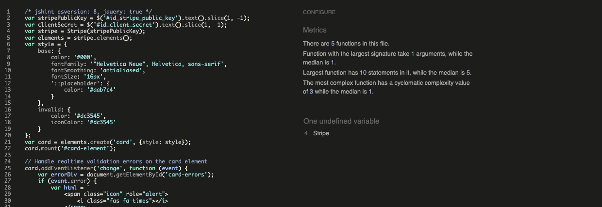
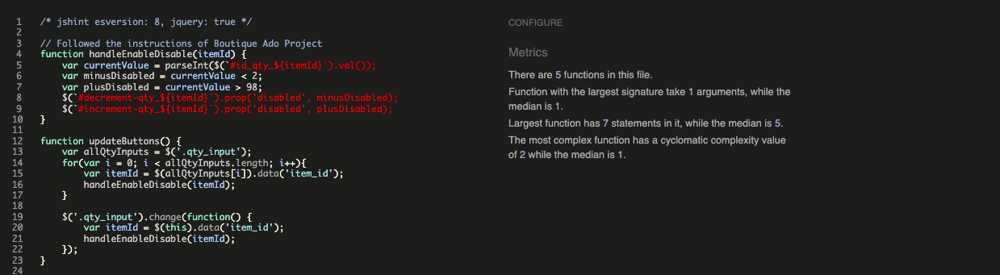

[Code Validation](#code-validation)

# Testing

## Code Validation
### PEP8
Tested all python code with the [PEP8 checker](http://pep8online.com/):
- Lines are too long in `setting.py`

- Lines too long in products `views.py`

- The issues (blank lines, line too long, whitespaces) are fixed and besides the 2 know errors above the code is clean without errors

### JavaScript
Tested all javascript code with [JShint](https://jshint.com/):
- `stripe_elements.js`

- `cart.js`

- `product.js`

### HTML
Tested html code with [W3 HTML Validator](https://validator.w3.org/): 
- All good! No errors or warnings

### CSS
Tested css code with [W3 CSS Validator](https://jigsaw.w3.org/css-validator/): 
- All good! No errors

- screenshot for every device tested on

## Functionality testing
For testing responsiveness, styling and interactivity I used for the project [Chrome Developer Tools](https://developers.google.com/web/tools/chrome-devtools).

## Compatibility testing
The website was tested through virtual devices with Chrome Developer Tools.

[Live testing with Comparium](https://front.comparium.app/livetesting)
- Windows 10 Chrome 89.0
- Windows 10 Firefox 85.0
- Windows 10 Edge 86.0
- Windows 10 Opera 74.0
- Linux Firefox 81.0
- Linux Chrome 87.0
- Linux Opera 72.0

Tested locally: 
- MacOs Catalina Google Chrome Version 90.0.4430.212 (Official Build) (x86_64)
- MacOs Catalina Safari Version 13.1.1 (15609.2.9.1.2)

The website was tested on following hardware devices:
- Macbook Air with MacOs Catalina (13-inch, 2017)
- Macbook Pro with MacOs Catalina (Retina, 15-inch, Mid 2015)
- Huawei P30 Pro with Android 10
- Google Pixel 4a (5G) with Android 11
- Microsoft Surface 7 Pro with Windows 10

## Performance testing with [Lighthouse](https://developers.google.com/web/tools/lighthouse)
### Performance:

### Accessibility score:

### Best Practice & SEO:

## User stories testing
### As a business owner:

### As a user:

## Features

## Bugs and problems
- No image upload --> explain in Readme: replace image field with text(string) field -> (have user upload image somewhere else like aws)

- note in readme: you have to click 2times back when you are on the product_display page (because of JS reload)--> add it to Bugs section

- FAQ arrow is blue

- missing: askign to agree before delete in admin

- make delivery cost an environment variable --> mention in readme that it should be not hardcoded

order history --> security put user 

get_user_model instrad of usin the User model directly --> rust send link

### 

