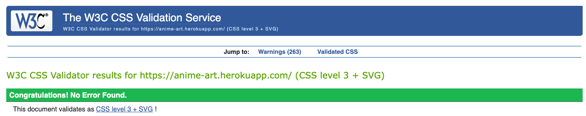

# Testing

## Table of contents
- [Code Validation](#code-validation)
- [Functionality testing](#functionality-testing)
- [Compatibility testing](#compatibility-testing)
- [Performance testing](#performance-testing)
- [User stories testing](#user-stories-testing)
    - [Business goals](#business-goals)
    - [Customer goals](#customer-goals)
- [Testing the features](#testing-the-features)
- [Bugs, problems and vulnerabilities](#bugs-problems-and-vulnerabilities)

## Code Validation
### PEP8
Tested all python code with the [PEP8 checker](http://pep8online.com/):
- Lines are too long in `setting.py`

- Lines too long in products `views.py`

- The issues (blank lines, line too long, whitespaces) are fixed and besides the 2 know errors above the code is clean without errors

### JavaScript
Tested all javascript code with [JShint](https://jshint.com/):
- `stripe_elements.js`

- `cart.js`

- `product.js`

### HTML
Tested html code with [W3 HTML Validator](https://validator.w3.org/): 
- All good! No errors or warnings

### CSS
Tested css code with [W3 CSS Validator](https://jigsaw.w3.org/css-validator/): 
- All good! No errors

## Functionality testing
For testing responsiveness, styling and interactivity I used for the project [Chrome Developer Tools](https://developers.google.com/web/tools/chrome-devtools).

## Compatibility testing
The website was tested through virtual devices with Chrome Developer Tools.

[Live testing with Comparium](https://front.comparium.app/livetesting)
- Linux Firefox 81.0
- Linux Chrome 87.0
- Linux Opera 72.0

Tested locally: 
- MacOs Catalina Google Chrome Version 90.0.4430.212 (Official Build) (x86_64)
- MacOs Catalina Safari Version 13.1.1 (15609.2.9.1.2)

The website was tested on following hardware devices:
- Macbook Air with MacOs Catalina (13-inch, 2017)
- Macbook Pro with MacOs Catalina (Retina, 15-inch, Mid 2015)
- Huawei P30 Pro with Android 10
- Google Pixel 4a (5G) with Android 11
- Microsoft Surface 7 Pro with Windows 10

## Performance testing
with [Lighthouse](https://developers.google.com/web/tools/lighthouse)
### Overall score

### Performance

### Accessibility score

### Best Practice

### SEO

## User stories testing
### Business goals
#### As a business owner,
- I want to generate revenue by offering a product that can be purchased through a webshop.
    > I am offering a product that can be purchased through an online shop.
    

- I want the user to understand what product I am offering.
    > The user can read more about the product on the `about` page.
    

- I want to offer only exclusive products, that a user cannot purchase anywhere else.
    > The products that can be purchased are created by an artist that does not sell them anywhere else. This is also documented in the `about` page.
    

- I want to be able to add a product so that I can add new products to the shop.
    > The superuser can add new products to the shop.
    

- I want to be able to edit a product so that I can update product information.
    > The superuser can update products.
    

- I want to be able to delete a product so that I can remove products from the shop.
    > The superuser can delete products from the shop.
    

### Customer goals
### As a user,
- I want to be able to view products so that I can purchase the products I like.
    > The user can view all products on the `product` list page.
    

- I want to be able to view the product details so that I can see the product name, product price, product description, and product image.
    > The user can view all details about each product in the `product display` page.
    

- I want to be able to understand what the webshop is selling so that I can evaluate if I am interested in the products.
    > The user can read a detailed explanation about the products in the `about` page.
    

- I want to be able to register for a user account so that I can view my profile.
    > The user can register for a user account and view the user profile
    

    

- I want to be able to login and logout so that I can access my profile.
    > The user can log in and out when a user account was created by this user before.
    

    

- I want to be able to reset my password so that I can access my profile in case I lost the password or secure my account by changing the password.
    > The user can reset the password by clicking on **"Forgot Password?"** on the login page.
    

- I want to be able to receive an email confirmation after registering so that I can know I registered successfully.
    > The user receives an email that needs to be confirmed to finalize the sign up process, but there won't be another email sent to confirm that the registration was successful.

- I want to be able to view my profile so that I can see my order history and save my information for future orders.
    > The user can see in the user profile the order histoy and can save personal information for future orders.

- I want to be able to filter products so that I can find easily the products by category.
    > The user can use the buttons on the `product` list page to filter products by type.
    

- I want to be able to search for a product by name or description so that I can find a specific product.
    > The user can use the search input field in the navigation area to search for products. If the search matches and `product name` or `product description`, it will be shown to the user. Otherwise the user will see an error message, that says, that the search criteria didn't match any product.
    

- I want to be able to see what I have searched for and the number of results so that I can know if there are results.
    > If the search results matches any product, the user will see it on the `product` list page. The user can not see here, what term was searched for and can also not see the number of results. The user will see either the matching products or an error message, that says, that the search criteria didn't match any product.
    

- I want to be able to select the quantity of a product so that I can purchase a certain amount.
    > The user can select the quanity of products on the `product display` page.
    

- I want to be able to view products in my cart so that I can always be aware of what I am about to purchase and how much it will cost.
    > The user can view at any time the cart contents, by either clicking on any `product display` page on **"Go to cart"** or clicking on the cart icon in the navigation.
    

- I want to be able to adjust the quantity of products in the cart so that I can delete or add more of the product.
    > The user can adjust the quantity of products in the cart by clicking on the increment or decrement buttons.
    

- I want to be able to delete products in my cart so that I can change my mind at any given time.
    > The user can always delete the items in the cart by clicking on the `delete` button next to the item.
    

- I want to be able to enter my payment information so that I can check out quickly and easily.
    > The user can enter the payment information and checkout with only one click.
    

- I want to be able to get an order confirmation after checkout so that I can double-check that my data is correct.
    > After the checkout the user will be redirected to a `checkout successful` page, where the order summary can be seen.
    

- I want to be able to receive an email confirmation so that I can keep track of my purchases and won't lose it.
    > The user receives an oder confirmation per email with an order summary after the checkout.
    

## Testing the features
### Navigation
- Click on all links to see if they work properly
- Click on the cart icon to see if it's linked properly
- Add a product into cart to see if next to the cart icon the total price is showing up
- Open an close ne navigation to see if it opens on the right side
- Click on different droodown menus, see if the previous opened one closes automatically when opening a new one
- Log in and see if the **"Account"** links change from **"Register"** and **"Login"** to **"My Profile"** and **"Logout"**
- Log in as an admin and see if there is an additional dropdown menu **"Admin"** with a dropdown item **"Add Products"**

### Search
- Search for an type or anime related keyword (such as "classic" or "naruto") of your choice to see if the search results are rendered properly on the page and the site structure is intact
- Search for an irrelevant keyword (such as "movie, "headphones, etc. ) of your choice to see if the page without results is rendered properly and the site structure is intact
- Search by submitting an empty input to see if you get get an error warning that you have to fill in the field before submitting

### Authentication (django-allauth feature)
- Try to register for an account
- See if you've received a verification e-mail and verify your e-mail
- Try to log in with your credentials
- Try to log out
- Try to reset your password and see if you receive an e-mail with instructions
- Choose a new password and try to change it
- Try to log in with your new credentials

### Messages (django, styled with bootstrap alerts)
- do a few actions of your choice mentioned below to see if the alert message appears under the header on top of the page_
    - add a product to the cart
    - update the products in the cart
    - remove an item from the cart
    - complete a checkout
    - log in
    - log out
- do some of these actions on mobile devices as well

### Back to top button
- Click the button in the right bottom corner after scrolling a bit on the page and see if it brings you to the top of the page

### Automatic emails
- Try some of the following actions
    - Make a test order
    - Register for an account
    - Reset your password
- see if you've received an email from "animeartonlineshop@gmail.com"

### Home app
`home` | `about`
- Click on the logo in the header of the page or in the navigation and see if the page renders properly
- Try hovering over the buttons to see if the grow effect works
- Click on any of the CTAs to see if you will be redirected properly
- Click in the navigation on "About us" item and see if the page renders properly
- On the "About us" page open and close the FAQ buttons to see if the previous button closes when opening a new one
- Click on the CTA on the "About us" page to see if you will be redirected properly

### Products app
`product` | `product_display` | `add_product` | `update_product`
- Click in the navigation on the different Products dropdown links and see if the page renders properly
- Try clicking on the filters on the product page and see if they filter correctly by type
- Click on any product and see if the product display page renders properly
- Click the increment and decrement buttons to see if the quantity changes
- Click "add to cart" to see if the item get added to the cart
- Click on "go to cart" to if you will be redirected to the cart 
- Click on "to product overview" to see if you will be redirected to the products page
- If you are an admin user:
    - Click in the navigation on the Admin dropdown the menu item "Add products" and see if the page renders properly
    - Try submitting the form with empty "Name, Description or Price" fields to see if the form validation works
    - Try uploading an image to see if the disabled image field works
    - Try filling out the form with test input and submit it to see if a new product will be added and the product has an image "Image coming soon"
    - Try clicking cancel to see if you will be redirected to the products page
    - Click on the "edit" button and see if the page renders properly and the forms is prefilled with the products' details
    - Try uploading an image to see if the disabled image field works
    - Try chaning any field in the form, submit and see if the product is updated properly
    - Try clicking cancel to see if you will be redirected to the products page and did not update the product
    - To test the delete functionality, add first a test product, then go to the product display page of the test product and click on the "delete" button, then check if the product is still available in the products page or not

### Cart app
`cart`
- Add a product to the cart
- Click either on the product display page "go to cart" or on the navigation click on the cart icon and see if the page renders properly
- Try increment or decrement the quantity and see if it works and the subtotoal price changes accordingly
- Check if the cart total and grand total prices are shown correctly
- Click the button "to product overview" to see if you will be redirected to the product list page
- Click the image in the cart to see if you will be redirected to the product display page of this product
- Click the delete button to see if the product will be removed from the cart

### Checkout app
`checkout`
- Click on the "Go to secure checkout" button at the bottom of the cart page
- See if all the order summary is correctly displayed and calculated
- Try submitting a form with some of the input fields empty to see if you get error messages
- Fill in the form as an anonymous user and do a test transaction
    - Credit card: 4242 4242 4242 4242
    - Expiration date: 04 / 24
    - CVC: 424
    - ZIP: 42424
- Fill in the form as a logged in user and check the 'Save this delivery information to my profile' box
- Do a test transaction and see if you're redirected to the "Order success" page and see if there appears your order summary
- For logged in users:
    - Check in your profile if the shipping information was properly saved on "Shipping/Billing Information"
    - Check in your account if the order appears in the "Order History"

### Profiles app
`profiles`
- Register for an account and log in by clicking on the 'Login' link in the "Account" dropdown in the navigation
- See if the page renders properly - you should be seeing the "order history" and the "Shipping/Billing Information" form
- If you haven't made any orders yet, you should just a text snippet
- Make a purchse, then click in the profile on the accordion button to open the order history details and see if everything is correct
- When you have more than one purchase see if the order history accordion works by clicking on a button, then on another and see if the previous cicked one closes automatically
- The "Shipping/Billing Information" should display your saved information that is pulled into the checkout form for a smooth check out - change the information and save it to see if everything gets saved properly
- Do a test transaction to see if the new details are correctly displayed in the checkout form

## Bugs, problems and vulnerabilities

- No image upload --> explain in Readme: replace image field with text(string) field -> (have user upload image somewhere else like aws)

- note in readme: you have to click 2times back when you are on the product_display page (because of JS reload)--> add it to Bugs section

- FAQ arrow is blue

- missing: askign to agree before delete in admin

- make delivery cost an environment variable --> mention in readme that it should be not hardcoded

order history --> security put user 

get_user_model instrad of usin the User model directly --> rust send link

delete button: security layer

- profile page footer --> not sticky
- loading times

DEBUG TRUE TO FALSE!!! doublecheck the 404

q:

- should I delete all my test users ?
- Should I delete all test orders?
- Login redirect landing page (when the user is in the checkout and logins, he goes to homepage)
- should I make the alerts push down the page or is overlay ok?
- Is it correct that I deleted "DISABLE_COLLECTSTATIC" in heroku config vars?